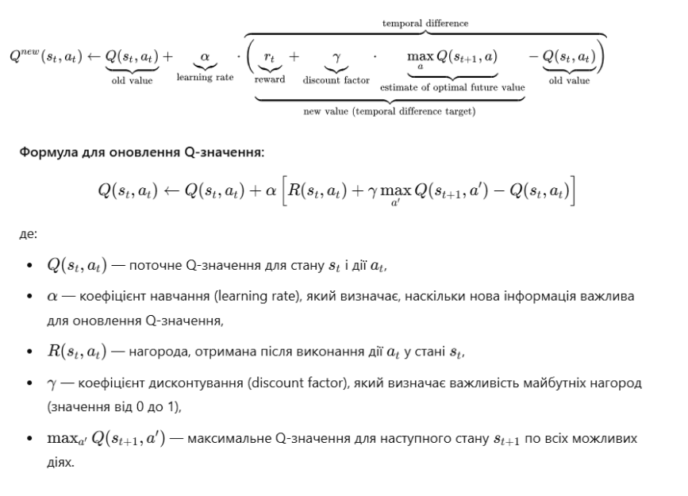

# Про проєкт

Це гра, ціль якої за допомогою машини довести пасажира до місця призначення.

Було задіяно навчання з підкріпленням (RL).

Навчання з підкріпленням (RL) - це частина екосистеми машинного навчання, де гравець навчається, взаємодіючи з середовищем, щоб отримати оптимальну стратегію для досягнення цілей. Це суттєво відрізняється від контрольованих алгоритмів (навчання з вчителем), де нам потрібно приймати та обробляти дані. Навчання з підкріпленням не потребує даних. Замість цього гравець вчиться в оточенні та системі винагород, щоб приймати кращі рішення.

У нашому випадку, головною задачею навчання з підкріпленням буде сформувати спеціальну Q-таблицю, яка буде містити оцінку вибору подальшого напрямку руху у кожній з позицій гравця.

Символом Q позначають функцію, яка повертає винагороду, що використовують для забезпечення підкріплення, і про яку можливо сказати, що вона відповідає «якості» (англ. Quality) дії, обраної в поточному стані.

Q-таблиця фактично представляє собою карту рухів гравця у кожному секторі поля.

Іншими словами - це словничок:
- у якості ключа - пара координат (X, Y) лівого верхнього кута гравця;
- у якості значення - масив з 4 значень. Кожне значення - це деяка числова оцінка вибору наступного напрямку. Кожна позиція (індекс) елементу масиву відповідає напрямку руху.

Наприклад, як виглядає один з елементів Q-таблиці:

(360, 200): [-2, -3, 5, 30]

Як виглядає Q-таблиця:

Принцип використання: який з напрямків має найбільшу оцінку, у такому напрямку і будемо робити наступний крок.

Наприклад, поточні координати верхнього лівого кута гравця state = (360,200).

Звертаємось до нашої таблиці та отримаємо масив оцінок напрямків: Q_table[state] = [-2, -3, 5, 30]

Беремо найбільший елемент цього масиву (число 30). Його позиція у масиві 3 (нагадую, нумерація елементів масиву починається з нуля).

Отже, у даному прикладі далі необхідно рухатись вниз.

Заповнення цієї таблиці відбувається під час навчання нашого гравця. Спочатку усі напрямки рівнозначні, тобто уся таблиця заповнена нулями. У кожному секторі ми повинні прийняти рішення, куди рухатись далі. На перших етапах, поки усі напрямки рівнозначні, це буде довільний рух. Зробивши крок у відповідному напрямку, ми аналізуємо нове положення гравця і видаємо винагороду за таким принципом:

якщо врізався у клумбу або готель, винагорода -100;
якщо заїхав на парковку, винагорода +100;
інакше винагорода -1
Сама ж оцінка результату вибраного напрямку руху для поточної позиції гравця формується за спеціальною математичною формулою:

